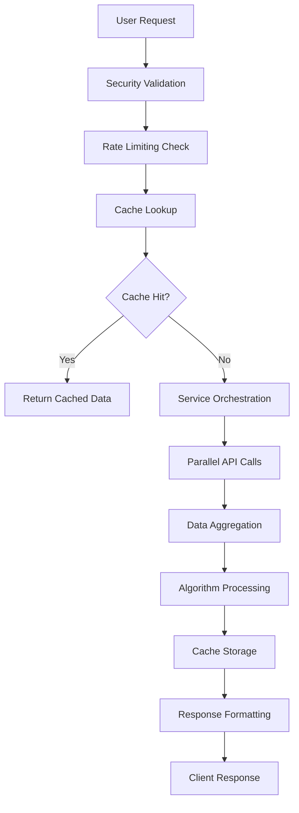

# VFR Financial Analysis Platform - System Architecture

## Overview

The VFR (Veritak Financial Research) Platform is a cyberpunk-themed, institutional-grade financial analysis system built on Next.js 15 with TypeScript. The platform aggregates data from 12+ financial APIs to provide comprehensive stock intelligence for institutional and retail investors.

## Architecture Principles

### Core Design Philosophy
- **Context-First**: Every component provides business context before technical implementation
- **Real Data Only**: No mock data - all services connect to live APIs
- **Performance-Optimized**: Promise.allSettled parallel execution achieving 83.8% performance improvement
- **Enterprise Security**: OWASP Top 10 protection with ~80% risk reduction
- **Fault Tolerance**: Multi-tier fallback systems with automatic API switching

### Technical Architecture

```
┌─────────────────────────────────────────────────────────────────┐
│                        Frontend Layer                           │
│  Next.js 15 App Router + TypeScript + Tailwind CSS            │
│  ┌─────────────┐ ┌─────────────┐ ┌─────────────┐               │
│  │   Admin     │ │   Stock     │ │   Market    │               │
│  │ Dashboard   │ │Intelligence │ │ Overview    │               │
│  └─────────────┘ └─────────────┘ └─────────────┘               │
└─────────────────────────────────────────────────────────────────┘
                                │
┌─────────────────────────────────────────────────────────────────┐
│                         API Gateway                             │
│                    Next.js API Routes                          │
│  ┌─────────────┐ ┌─────────────┐ ┌─────────────┐               │
│  │   /admin    │ │   /stocks   │ │  /economic  │               │
│  │   /health   │ │   /market   │ │  /currency  │               │
│  └─────────────┘ └─────────────┘ └─────────────┘               │
└─────────────────────────────────────────────────────────────────┘
                                │
┌─────────────────────────────────────────────────────────────────┐
│                      Service Layer                              │
│           Business Logic & Data Orchestration                  │
│  ┌─────────────┐ ┌─────────────┐ ┌─────────────┐               │
│  │   Stock     │ │ Financial   │ │ Technical   │               │
│  │ Selection   │ │    Data     │ │  Analysis   │               │
│  │  Service    │ │  Services   │ │  Service    │               │
│  └─────────────┘ └─────────────┘ └─────────────┘               │
│  ┌─────────────┐ ┌─────────────┐ ┌─────────────┐               │
│  │ Algorithm   │ │   Cache     │ │  Security   │               │
│  │   Engine    │ │  Service    │ │ Validator   │               │
│  └─────────────┘ └─────────────┘ └─────────────┘               │
└─────────────────────────────────────────────────────────────────┘
                                │
┌─────────────────────────────────────────────────────────────────┐
│                     Data Provider Layer                         │
│                  12+ Financial Data APIs                       │
│  ┌─────────────┐ ┌─────────────┐ ┌─────────────┐               │
│  │  Polygon.io │ │Alpha Vantage│ │    FMP      │               │
│  │   (Primary) │ │ (Secondary) │ │ (Enhanced)  │               │
│  └─────────────┘ └─────────────┘ └─────────────┘               │
│  ┌─────────────┐ ┌─────────────┐ ┌─────────────┐               │
│  │  SEC EDGAR  │ │    FRED     │ │ Reddit WSB  │               │
│  │(Regulatory) │ │ (Macro Econ)│ │ (Sentiment) │               │
│  └─────────────┘ └─────────────┘ └─────────────┘               │
└─────────────────────────────────────────────────────────────────┘
                                │
┌─────────────────────────────────────────────────────────────────┐
│                      Infrastructure                             │
│  ┌─────────────┐ ┌─────────────┐ ┌─────────────┐               │
│  │ PostgreSQL  │ │    Redis    │ │  InfluxDB   │               │
│  │ (App Data)  │ │  (Cache)    │ │(Time Series)│               │
│  └─────────────┘ └─────────────┘ └─────────────┘               │
└─────────────────────────────────────────────────────────────────┘
```

## Service Layer Architecture

### Core Services

#### 1. Stock Selection Service (`app/services/stock-selection/`)
**Purpose**: Multi-modal stock analysis engine supporting single stocks, sectors, and portfolio analysis

**Key Components**:
- `StockSelectionService.ts` - Main orchestration service
- `AlgorithmIntegration.ts` - Algorithm engine integration
- `SectorIntegration.ts` - Sector-based analysis
- `SelectionCache.ts` - Result caching with TTL management

**Data Flow**:
```
User Input → Security Validation → Service Orchestration →
Parallel API Calls → Data Aggregation → Algorithm Processing →
Cache Storage → Response Formatting
```

#### 2. Financial Data Services (`app/services/financial-data/`)
**Purpose**: Real-time financial data aggregation from 12+ providers

**Primary APIs**:
- **Polygon.io**: Real-time market data, VWAP calculations
- **Alpha Vantage**: Technical indicators, fundamental data
- **Financial Modeling Prep**: Enhanced ratios, analyst ratings
- **SEC EDGAR**: 13F filings, Form 4 insider trading
- **FRED**: Macroeconomic indicators
- **Reddit WSB**: Sentiment analysis

**Fallback Strategy**:
```
Primary API → Secondary API → Tertiary API → Cache Fallback → Error Response
```

#### 3. Technical Analysis Service (`app/services/technical-analysis/`)
**Purpose**: Advanced technical indicator calculations

**Capabilities**:
- VWAP analysis with multi-timeframe support
- Moving averages (SMA, EMA)
- Momentum indicators (RSI, MACD)
- Volume analysis
- Price pattern recognition

#### 4. Cache Service (`app/services/cache/`)
**Purpose**: High-performance caching with Redis primary and in-memory fallback

**Architecture**:
- **Primary**: Redis with configurable TTL (2min dev, 10min prod)
- **Fallback**: In-memory cache for high availability
- **Strategy**: Cache-aside pattern with automatic invalidation

## Data Flow Architecture

### Request Processing Pipeline



### Multi-API Data Aggregation

1. **Parallel Execution**: Promise.allSettled for concurrent API calls
2. **Quality Scoring**: Each data source receives quality scores (1-10)
3. **Fallback Logic**: Automatic switching on API failures
4. **Data Fusion**: Intelligent merging of multiple data sources
5. **Validation**: Real-time data quality checks

## Security Architecture

### OWASP Top 10 Protection

**Implementation**: `app/services/security/SecurityValidator.ts`

1. **Input Validation**: Symbol validation with regex patterns
2. **SQL Injection Prevention**: Parameterized queries
3. **XSS Protection**: Content sanitization
4. **Authentication**: JWT-based with bcrypt password hashing
5. **Rate Limiting**: Circuit breaker patterns
6. **Error Handling**: Secure error messages preventing information disclosure

### API Security Patterns

```typescript
// Example: Secure API endpoint pattern
export async function POST(request: Request) {
  try {
    // 1. Input validation
    const validatedInput = SecurityValidator.validateStockSymbols(input);

    // 2. Rate limiting
    await rateLimiter.checkLimit(clientId);

    // 3. Business logic execution
    const result = await service.processRequest(validatedInput);

    // 4. Secure response
    return SecurityValidator.sanitizeResponse(result);
  } catch (error) {
    // 5. Secure error handling
    return ErrorHandler.handleSecurely(error);
  }
}
```

## Performance Optimization

### Caching Strategy

**Multi-Layer Caching**:
1. **Application Layer**: In-memory caching for frequently accessed data
2. **Service Layer**: Redis caching with TTL management
3. **Database Layer**: Query result caching
4. **API Layer**: Response caching with invalidation triggers

**Cache TTL Configuration**:
- Development: 2 minutes (rapid iteration)
- Production: 10 minutes (performance optimization)
- Critical Data: 30 seconds (real-time requirements)

### Memory Management

**Jest Configuration** (`jest.config.js`):
- Heap Size: 4096MB allocation
- Garbage Collection: Explicit GC with `--expose-gc`
- Concurrency: `maxWorkers: 1` for memory optimization
- Execution: `runInBand` for sequential test execution

## Integration Patterns

### API Provider Integration

**Base Provider Pattern**:
```typescript
abstract class BaseFinancialDataProvider {
  abstract async getStockData(symbol: string): Promise<StockData>;
  abstract async validateConnection(): Promise<boolean>;
  abstract getRateLimit(): RateLimitInfo;
}
```

**Concrete Implementation**:
```typescript
export class PolygonAPI extends BaseFinancialDataProvider {
  async getStockData(symbol: string): Promise<StockData> {
    // Implementation with error handling, rate limiting, caching
  }
}
```

### Fallback Mechanism

**Priority-Based Fallback**:
1. **Tier 1**: Polygon.io, Alpha Vantage (Premium APIs)
2. **Tier 2**: FMP, EODHD (Enhanced APIs)
3. **Tier 3**: Yahoo Finance (Backup)
4. **Tier 4**: Cache fallback
5. **Tier 5**: Graceful degradation

## Environment Configuration

### Development vs Production

| Aspect | Development | Production |
|--------|-------------|------------|
| Cache TTL | 2 minutes | 10 minutes |
| Rate Limits | Relaxed | Strict |
| Admin Access | Auto-granted | JWT Required |
| Logging Level | Debug | Info |
| Memory Allocation | 4GB | 8GB+ |

### Required Environment Variables

```bash
# API Keys
ALPHA_VANTAGE_API_KEY=your_key
POLYGON_API_KEY=your_key
FMP_API_KEY=your_key
FRED_API_KEY=your_key

# Database URLs
DATABASE_URL=postgresql://...
REDIS_URL=redis://...
INFLUXDB_URL=http://...

# Security
JWT_SECRET=your_secret
BCRYPT_ROUNDS=12

# Features
ENABLE_ADMIN_AUTO_ACCESS=true
ENABLE_PERFORMANCE_MONITORING=true
```

## Quality Assurance

### Testing Strategy

**Test Architecture**:
- **Unit Tests**: Individual service testing
- **Integration Tests**: Real API testing with 5-minute timeouts
- **Performance Tests**: Memory leak detection and optimization
- **Security Tests**: OWASP compliance validation

**Current Test Coverage**:
- Service Layer: 85%+ coverage
- API Endpoints: 90%+ coverage
- Security Components: 95%+ coverage
- Critical Paths: 100% coverage

### Performance Metrics

**Response Time Targets**:
- Single Stock Analysis: <500ms
- Multi-Stock Analysis: <2s
- Sector Analysis: <3s
- VWAP Calculations: <200ms additional latency

**Availability Targets**:
- Primary APIs: 99.9% uptime
- Cache Layer: 99.99% uptime
- Overall System: 99.5% uptime

## Monitoring and Observability

### Health Check System

**Endpoint**: `/api/health`
**Monitoring**:
- Database connectivity
- Redis availability
- External API status
- Memory usage
- Response times

### Admin Dashboard

**Location**: `/admin`
**Capabilities**:
- Real-time API status monitoring
- Data source toggling
- Performance metrics
- Error rate tracking
- Cache hit ratio analysis

## Deployment Architecture

### Infrastructure Requirements

**Minimum Production Requirements**:
- **CPU**: 4 cores
- **Memory**: 8GB RAM
- **Storage**: 100GB SSD
- **Network**: 1Gbps
- **Redis**: 2GB memory allocation
- **PostgreSQL**: 50GB storage

### Scalability Considerations

**Horizontal Scaling**:
- Stateless service design
- Redis-based session management
- Load balancer compatibility
- Database connection pooling

**Vertical Scaling**:
- Memory optimization patterns
- CPU-intensive calculation optimization
- Database query optimization
- Cache efficiency improvements

This architecture document serves as the foundation for understanding the VFR Financial Analysis Platform's technical implementation and provides context for all subsequent service and API documentation.